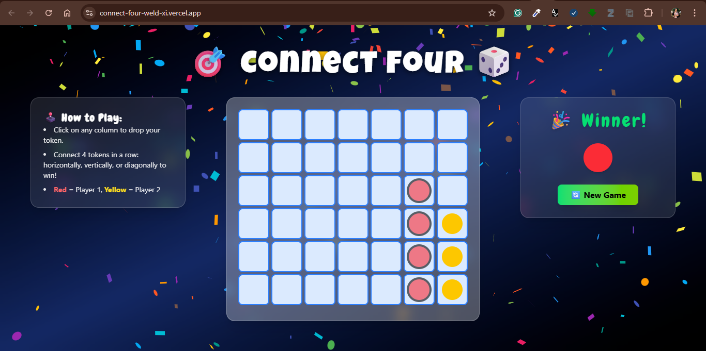

# 🎯 Connect Four 🎲

A modern, interactive implementation of the classic **Connect Four** game, built using **React**, **Vite**, and **Tailwind CSS**. Designed with a fully responsive layout, dynamic game logic, celebratory animations, and an intuitive UI for both desktop and mobile devices.

[🔗 Live Demo](https://connect-four-weld-xi.vercel.app/)

## 📸 Preview

 

---

## 🚀 Features

- 🎮 **Interactive Gameplay**: Drop tokens into columns to connect four in a row (horizontal, vertical, or diagonal).
- 👥 **Two-Player Mode**: Alternates turns between Player 1 (Red) and Player 2 (Yellow).
- 🎉 **Win Detection & Confetti**: Automatic winner detection with visual celebration using confetti.
- 🔄 **Restart Option**: Easily reset the board to start a new game.
- 📱 **Responsive Design**: Optimized for mobile, tablet, and desktop screens.
- 🌈 **Modern UI**: Styled with Tailwind CSS and dynamic visuals for smooth animations.

---

## 🛠️ Tech Stack

- ⚛️ **React** – UI library
- ⚡ **Vite** – Fast development build tool
- 🎨 **Tailwind CSS** – Utility-first styling
- 📦 **react-use** – Media query hooks and window size detection
- 🎊 **react-confetti** – Confetti celebration on win

## 📦 Installation & Running Locally

### 1. Clone the repository
git clone https://github.com/sehajini1/Connect-four.git

cd connect-four-game

### 2. Install dependencies
npm install

### 3. Start the development server
npm run dev

